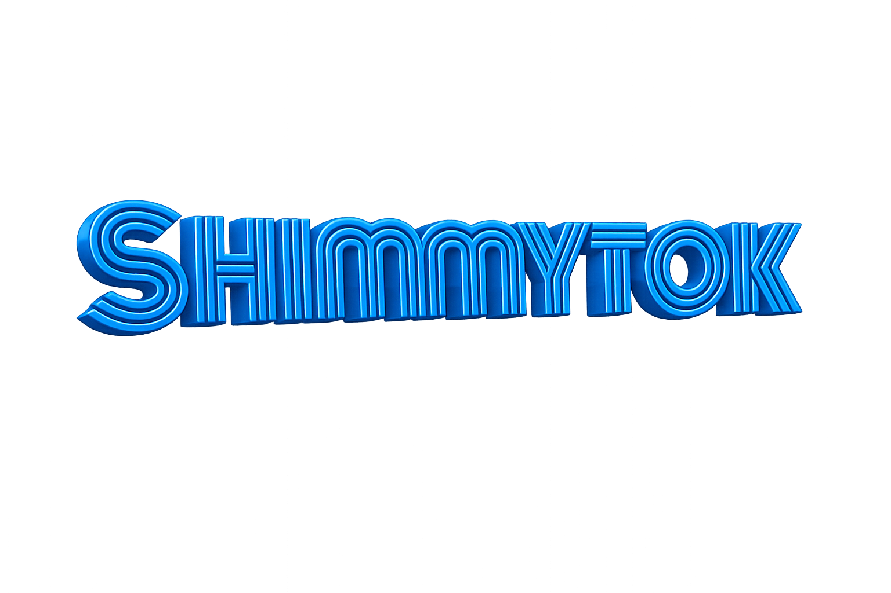

<div align="center">



### Pure Rust tokenizer for GGUF models
**100% llama.cpp compatible • zero C++ • just works**

[](https://opensource.org/licenses/MIT)
[](https://crates.io/crates/shimmytok)
[](https://rustup.rs/)
[](https://github.com/sponsors/Michael-A-Kuykendall)

</div>

---

**shimmytok is free forever.** MIT licensed, no strings attached.

💝 **If shimmytok helps you, consider [sponsoring](https://github.com/sponsors/Michael-A-Kuykendall).**

---

## Features

- 🦀 **Pure Rust** - No C++ dependencies
- 📦 **Load from GGUF** - Read tokenizers directly from model files
- ✅ **Validated** - 10/10 llama.cpp vocab models passing
- 🎯 **Complete** - All llama.cpp tokenizer types: SPM, BPE, WPM, UGM, RWKV

## Installation

```toml
[dependencies]
shimmytok = "0.7"
```

## Usage

```rust
use shimmytok::Tokenizer;

// Load tokenizer from GGUF file
let tokenizer = Tokenizer::from_gguf_file("model.gguf")?;

// Encode text to token IDs
let tokens = tokenizer.encode("Hello world", true)?;

// Decode token IDs back to text
let text = tokenizer.decode(&tokens, true)?;
```

## Validated Models

All models validated against `llama-tokenize` with exact token match:

| Model | Type | Status |
|-------|------|--------|
| bert-bge | WPM | ✅ |
| command-r | BPE | ✅ |
| deepseek-coder | BPE | ✅ |
| deepseek-llm | BPE | ✅ |
| falcon | BPE | ✅ |
| gpt-2 | BPE | ✅ |
| llama-spm | SPM | ✅ |
| qwen2 | BPE | ✅ |
| refact | BPE | ✅ |
| starcoder | BPE | ✅ |

## Tokenizer Coverage

| Type | Algorithm | Status |
|------|-----------|--------|
| SPM | SentencePiece resegment | ✅ |
| BPE | Priority queue merge + 41 pre-tokenizer patterns | ✅ |
| WPM | Word-Piece greedy longest match | ✅ |
| UGM | Unigram Viterbi DP | ✅ |
| RWKV | Trie-based greedy | ✅ |
| PLaMo-2 | Table-driven reverse DP | ✅ |

## API

```rust
// Core
Tokenizer::from_gguf_file(path) -> Result<Tokenizer>
tokenizer.encode(text, add_special_tokens) -> Result<Vec<TokenId>>
tokenizer.decode(&tokens) -> Result<String>
tokenizer.decode_single(token_id) -> Result<String>

// Metadata
tokenizer.vocab_size() -> usize
tokenizer.bos_token() -> Option<TokenId>
tokenizer.eos_token() -> Option<TokenId>
tokenizer.model_type() -> &str
tokenizer.pre_type() -> &str

// Batch
tokenizer.encode_batch(texts, add_special) -> Result<Vec<Vec<TokenId>>>
```

## Why shimmytok?

- **No C++**: Works anywhere Rust works (WASM, embedded, etc.)
- **No separate files**: Loads tokenizer directly from GGUF
- **Correctness first**: Every tokenizer validated against llama.cpp

## Links

- **📖 [CHANGELOG](CHANGELOG.md)** - Version history
- **🗺️ [ROADMAP](ROADMAP.md)** - Future plans
- **🤝 [CONTRIBUTING](CONTRIBUTING.md)** - How to contribute
- **🔒 [SECURITY](SECURITY.md)** - Vulnerability reporting

## License

MIT License - forever.

---

**Maintainer**: Michael A. Kuykendall

## See Also

- [libshimmy](https://github.com/yourusername/libshimmy) - Pure Rust LLM inference engine that uses shimmytok
- [llama.cpp](https://github.com/ggerganov/llama.cpp) - Reference C++ implementation
- [GGUF format spec](https://github.com/ggerganov/ggml/blob/master/docs/gguf.md)
