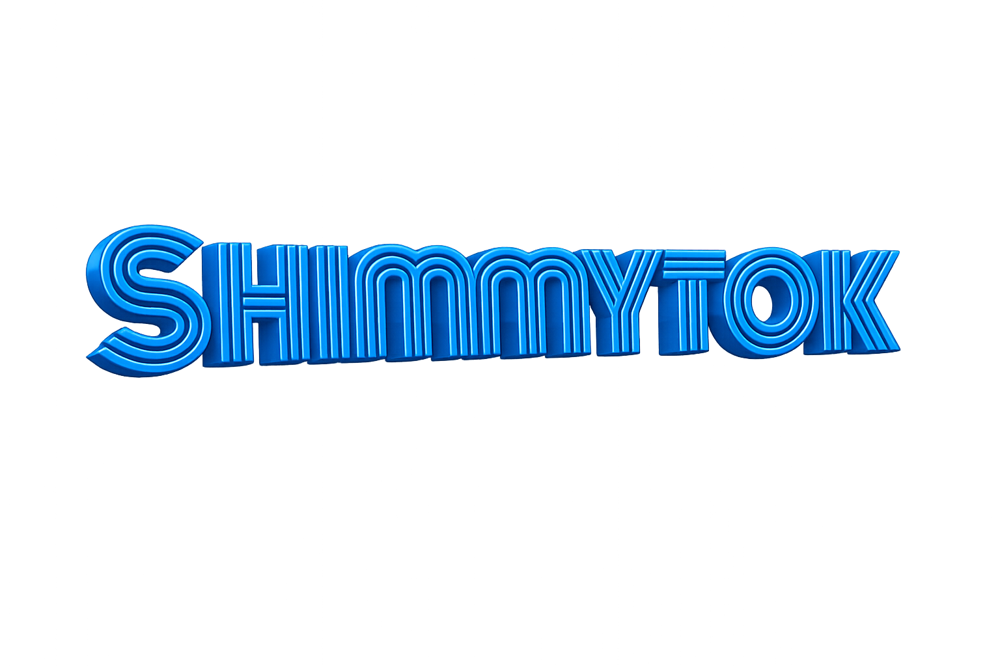

<div align="center">



### Pure Rust tokenizer for GGUF models
**100% llama.cpp compatible • zero C++ • just works**

[](https://opensource.org/licenses/MIT)
[](https://crates.io/crates/shimmytok)
[](https://rustup.rs/)
[](https://github.com/sponsors/Michael-A-Kuykendall)

</div>

---

**shimmytok is free forever.** MIT licensed, no strings attached.

💝 **If shimmytok helps you, consider [sponsoring](https://github.com/sponsors/Michael-A-Kuykendall).**

### 💝 Support shimmytok

🚀 **If shimmytok helps you, consider [sponsoring](https://github.com/sponsors/Michael-A-Kuykendall) — 100% of support goes to keeping it free forever.**

- **$5/month**: Coffee Hero ☕ — Eternal gratitude + name in [SPONSORS.md](SPONSORS.md)
- **$25/month**: Developer Supporter 🐛 — Priority bug response + roadmap influence
- **$100/month**: Corporate Backer 🏢 — Logo in README + release-note recognition
- **$500/month**: Enterprise Partner 🚀 — Prominent logo + monthly office hours + roadmap input

[**🎯 Become a Sponsor**](https://github.com/sponsors/Michael-A-Kuykendall) | See our amazing [sponsors](SPONSORS.md) 🙏

**Thank you to our sponsors:** [ZephyrCloudIO](https://github.com/ZephyrCloudIO) (Corporate Backer) · alistairheath (Coffee Hero)

---

## ✨ What is shimmytok?

shimmytok is a **pure Rust tokenizer library** that reads tokenizers directly from GGUF model files. No Python, no C++, no separate tokenizer files — just point it at your `.gguf` and go.

### Why does this matter?

When you download a GGUF model, the tokenizer is embedded inside. Most Rust projects either:
- Bind to C++ (llama.cpp FFI) — adds build complexity
- Use separate tokenizer files — requires extra downloads
- Roll their own — risk of incompatibility

**shimmytok extracts and runs the tokenizer directly from your GGUF file**, producing identical output to llama.cpp.

## 🎯 v0.7.0 Highlights

This release achieves **full llama.cpp tokenizer parity**:

- ✅ **6 tokenizer algorithms** — SPM, BPE, WPM, UGM, RWKV, PLaMo-2
- ✅ **41 BPE pre-tokenization patterns** — GPT-2, Llama-3, Qwen, DeepSeek, and more
- ✅ **10/10 vocab models validated** — Exact token match against `llama-tokenize`
- ✅ **~4,000 lines of Rust** — Focused, auditable, no bloat

## Features

- 🦀 **Pure Rust** — No C++ dependencies, compiles anywhere
- 📦 **Load from GGUF** — Tokenizer embedded in model file
- ✅ **Validated** — Every algorithm tested against llama.cpp
 - ⚡ **Fast** — Batch encoding with optional Rayon parallelism for large workloads
- 🌊 **Streaming** — Token-by-token decoding for LLM output
- 🔒 **Safe** — Zero unsafe code in critical paths

## Installation

```toml
[dependencies]
shimmytok = "0.7"
```

## Quick Start

```rust
use shimmytok::Tokenizer;

// Load tokenizer from any GGUF model
let tokenizer = Tokenizer::from_gguf_file("llama-3.gguf")?;

// Encode text to tokens
let tokens = tokenizer.encode("Hello, world!", true)?;
println!("Tokens: {:?}", tokens);

// Decode back to text
let text = tokenizer.decode(&tokens, true)?;
println!("Text: {}", text);

// Stream tokens one at a time (for LLM generation)
for token_id in tokens {
    print!("{}", tokenizer.decode_single(token_id, false)?);
}
```

## Validated Models

All models produce **exact token match** with `llama-tokenize`:

| Model | Tokenizer | Status |
|-------|-----------|--------|
| llama-spm | SentencePiece | ✅ Match |
| gpt-2 | BPE | ✅ Match |
| qwen2 | BPE | ✅ Match |
| starcoder | BPE | ✅ Match |
| deepseek-coder | BPE | ✅ Match |
| deepseek-llm | BPE | ✅ Match |
| falcon | BPE | ✅ Match |
| command-r | BPE | ✅ Match |
| refact | BPE | ✅ Match |
| bert-bge | WordPiece | ✅ Match |

## Tokenizer Algorithms

shimmytok implements all tokenizer types from llama.cpp:

| Type | Algorithm | Models |
|------|-----------|--------|
| **SPM** | SentencePiece with resegment | LLaMA, Mistral, Gemma |
| **BPE** | Byte-Pair Encoding + regex pre-tokenization | GPT-2, Qwen, StarCoder, DeepSeek |
| **WPM** | WordPiece (BERT-style) | BERT, BGE embeddings |
| **UGM** | Unigram (Viterbi DP) | T5, mT5 |
| **RWKV** | Trie-based greedy | RWKV World |
| **PLaMo-2** | Table-driven reverse DP | PLaMo-2 |

### BPE Pre-tokenization Patterns

shimmytok supports **41 different regex patterns** for BPE pre-tokenization, covering:

- GPT-2/GPT-3/GPT-4 style
- Llama-3 style  
- Qwen/Qwen2 style
- DeepSeek (coder + LLM variants)
- StarCoder/StarCoder2
- Falcon, Command-R, DBRX
- And many more...

## API Reference

### Core Methods

```rust
// Load from GGUF file
let tokenizer = Tokenizer::from_gguf_file("model.gguf")?;

// Encode text → tokens
let tokens = tokenizer.encode("Hello", true)?;  // true = add BOS/EOS

// Decode tokens → text  
let text = tokenizer.decode(&tokens, true)?;    // true = skip special tokens

// Streaming decode (for LLM generation)
let piece = tokenizer.decode_single(token_id, false)?;
```

### Metadata

```rust
tokenizer.vocab_size()    // → usize
tokenizer.bos_token()     // → Option<TokenId>  
tokenizer.eos_token()     // → Option<TokenId>
tokenizer.model_type()    // → &str ("llama", "gpt2", etc.)
tokenizer.pre_type()      // → &str (pre-tokenization pattern)
```

### Batch & Advanced

```rust
// Batch encoding — always available; large native batches run in parallel
let batch = tokenizer.encode_batch(&["text1", "text2"], true)?;

// Token introspection
tokenizer.token_to_piece(token_id)?  // → Vec<u8>
tokenizer.token_type(token_id)       // → Option<TokenType>
tokenizer.is_special_token(token_id) // → bool
```

## Use Cases

- **LLM Inference Engines** — Pure Rust inference without C++ bindings
- **WASM Applications** — Run tokenization in the browser
- **Embedded Systems** — No C++ toolchain required
- **CLI Tools** — Inspect and debug GGUF tokenizers
- **Research** — Understand tokenization without black boxes

## Performance

shimmytok prioritizes **correctness over speed**, but it's still fast:

- Immutable per-model BPE state (regexes and merge ranks prepared once, no per-encode locks)
- Batch encoding that dispatches to Rayon only when the workload is large enough
  to outweigh scheduling overhead (measured crossover — see `benches/tokenization.rs`);
  smaller batches, `--no-default-features`, and WASM/WASI run sequentially
- Efficient trie structures for UGM/RWKV

Batch results are always deterministic and order-preserving regardless of backend.
For most use cases, tokenization is not the bottleneck — inference is.

## Links

- **📖 [CHANGELOG](CHANGELOG.md)** — Version history  
- **🗺️ [ROADMAP](ROADMAP.md)** — Future plans
- **🤝 [CONTRIBUTING](CONTRIBUTING.md)** — How to contribute
- **🔒 [SECURITY](SECURITY.md)** — Vulnerability reporting
- **📚 [docs.rs](https://docs.rs/shimmytok)** — API documentation

## Related Projects

- **[llama.cpp](https://github.com/ggerganov/llama.cpp)** — Reference C++ implementation
- **[GGUF spec](https://github.com/ggerganov/ggml/blob/master/docs/gguf.md)** — File format documentation

## License

MIT License — free forever, no strings attached.

---

**Maintainer**: Michael A. Kuykendall  
**Mission**: Pure Rust tokenization for the LLM ecosystem
